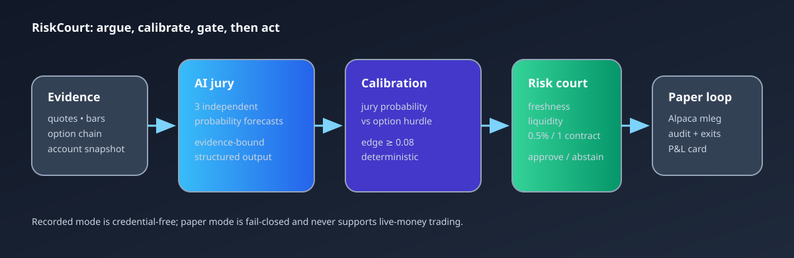

# RiskCourt

RiskCourt is a paper-only options agent that treats AI forecasts as a small prediction market. Independent jurors estimate an outcome, a calibration layer turns those forecasts into a bounded probability, and a deterministic risk court trades a defined-risk spread only when the jury probability clears an option-payoff hurdle.



> **Paper-trading disclosure:** RiskCourt is an experimental research and hackathon project. Paper fills and P&L are simulated, do not represent live performance, and are not investment advice. Options involve substantial risk.

## Why it is different

The UI puts the two sides of the decision next to each other: jury odds and the market's break-even proxy. The agents do not choose size, bypass stale data, or submit an order directly. They return structured forecasts with evidence IDs; deterministic policy decides whether to abstain, veto, resize, submit, or exit.

## Architecture

1. **Evidence and jurors** — price/market structure, catalyst/news, and volatility/options jurors produce independent probability forecasts, confidence stakes, uncertainty, invalidation, and cited evidence.
2. **Calibration and edge** — forecasts are shrunk toward 50% by historical calibration, weighted by calibration × stake, then compared with the selected spread's payoff-geometry hurdle.
3. **Risk court** — freshness, liquidity, expiry, symbol, edge, account, drawdown, duplicate, approval, and kill-switch gates fail closed. The MVP permits at most one contract and caps loss at 0.5% of account equity.
4. **Paper execution** — the Alpaca Trading API adapters read account/clock/underlying/option-chain state and map approved vertical debit spreads to `order_class=mleg` requests with deterministic client order IDs.
5. **Audit and P&L** — immutable evidence-bound events, order lifecycle records, deterministic exits, and P&L snapshots feed the judge-facing Decision Card.

## Strategy in one line

For a same-expiry vertical debit spread, `hurdle = (net debit + slippage buffer) / strike width`; enter only when `calibrated jury probability − hurdle ≥ 0.08`. See the worked example and assumptions in [`docs/STRATEGY_MATH.md`](docs/STRATEGY_MATH.md).

## Run the recorded demo

Recorded mode is the default and requires no credentials or network access.

```powershell
# backend
cd backend
py -3.12 -m venv .venv
.\.venv\Scripts\python.exe -m pip install -e ".[dev]"
.\.venv\Scripts\python.exe -m pytest

# frontend (in a second terminal)
cd frontend
npm install
npm run dev
```

Open the Vite URL and use the recorded cases. The full local gate is:

```powershell
backend\.venv\Scripts\python.exe scripts\verify.py --skip-e2e
```

For paper mode, copy [`.env.example`](.env.example) to an ignored `.env`, set paper credentials only, and keep `RISKCOURT_MODE=paper`. The application rejects live-trading flags and non-official Alpaca endpoints. Never commit keys or an account ID.

The backend exposes a sanitized `GET /healthz` readiness probe and the recorded-case API. A hosted frontend may set `VITE_RISKCOURT_API_URL` using [`frontend/.env.example`](frontend/.env.example); failed, missing, or malformed API responses automatically fall back to the bundled recorded fixtures. No public route submits or cancels orders.

For credentialed operator verification, the paper-cycle command is explicitly
dry-run by default and persists its audit chain only when `--submit` is passed:
see [`backend/README.md`](backend/README.md). After deployment, run the
GET-only hosted release checker [`scripts/verify_hosted.py`](scripts/verify_hosted.py)
against the public frontend and backend origins. It refuses to treat a missing
health or recorded-case endpoint as a release pass.

## Evidence and current boundary

- Twelve credential-free evaluation cases cover trade, abstain, veto, and error paths: [`fixtures/evaluation/fd045.json`](fixtures/evaluation/fd045.json).
- Rehearsal timestamps, responsive/accessibility checks, and Gate D evidence are recorded in [`docs/DEMO_REHEARSAL.md`](docs/DEMO_REHEARSAL.md) and [`docs/GATE_D_EVIDENCE.md`](docs/GATE_D_EVIDENCE.md).
- Submission visuals are available as the [cover image](docs/assets/RiskCourt-cover.png), [PDF slides](docs/assets/RiskCourt-submission-slides.pdf), and [editable PowerPoint deck](docs/assets/RiskCourt-submission-slides.pptx).
- The Alpaca Trading API read adapters, restart-safe paper cycle, guarded multi-leg request mapping, lifecycle persistence, P&L snapshots, and deterministic exits are implemented. The current public Render deployment runs the credential-free recorded path from `main`; fresh-account and official paper-evidence confirmation, final media, and LabLab submission remain explicit release gates. See the redaction-safe capture template [`docs/ALPACA_TOOL_EVIDENCE.md`](docs/ALPACA_TOOL_EVIDENCE.md).
- Security and claim review: [`docs/SECURITY_REVIEW.md`](docs/SECURITY_REVIEW.md). Submission requirements and account safeguards: [`docs/EVENT_REQUIREMENTS.md`](docs/EVENT_REQUIREMENTS.md) and [`docs/SUBMISSION_CHECKLIST.md`](docs/SUBMISSION_CHECKLIST.md).

## License

RiskCourt is released under the [MIT License](LICENSE).
